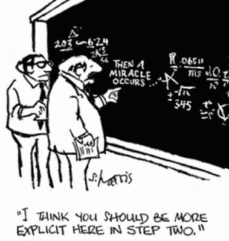
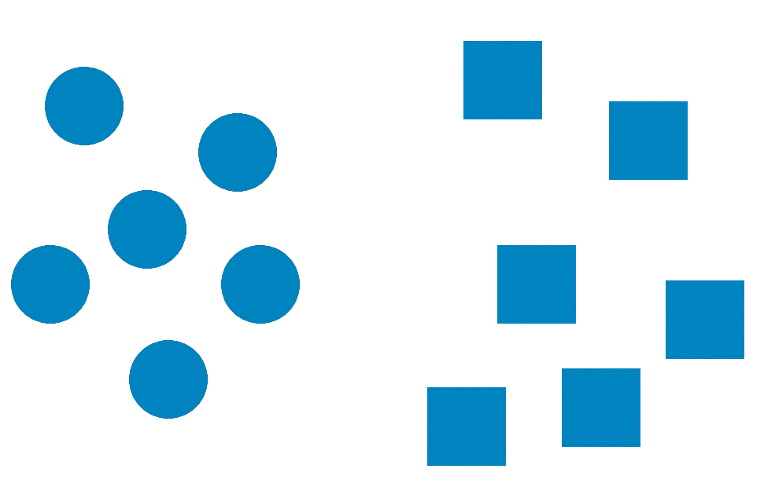
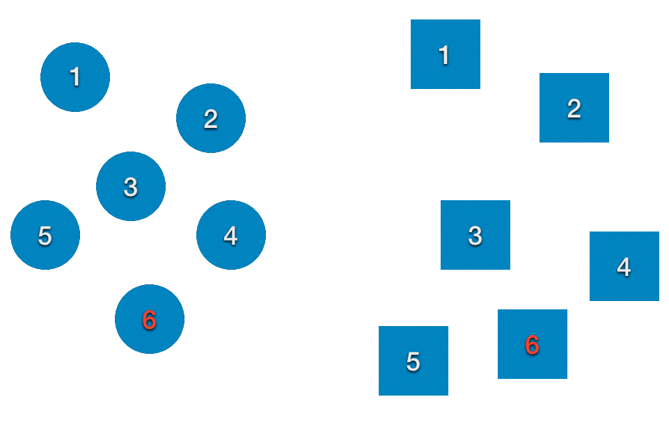
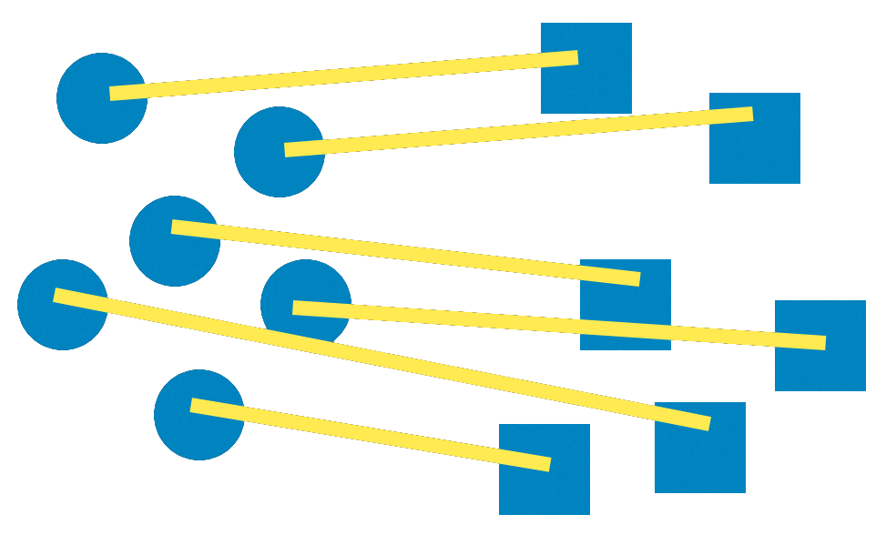
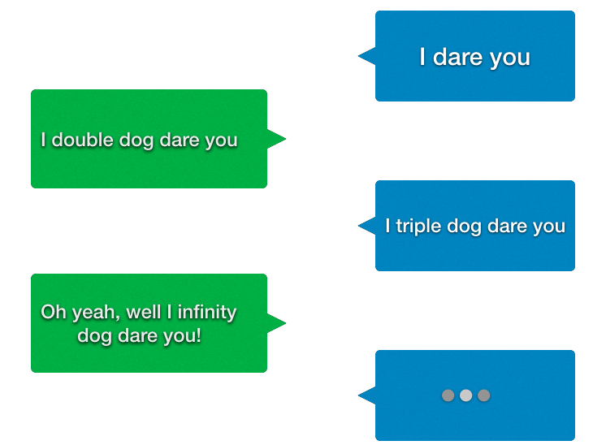

# [fit] $$\infty$$

---

# [fit] First
# [fit] ... a bit about proofs



---

> In mathematics, a proof is a deductive argument for a mathematical statement.
-- Wikipedia

---

> In the argument, other previously established statements, such as theorems, can be used.
-- Wikipedia

---


---

# [fit] *Many* forms of proofs

- Direct
- Contradiction
- Reducto ad Absurdum
- Existence
- Uniqueness
- Induction
- Construction
- …

---

# [fit] Proof by Contradiction

---

# Start with the opposite of the statement you wish to prove

---

# [fit] Use only existing premises

<br>

# [fit] _axioms, other proofs_

---

# [fit] If you reach an impossible state

<br>

# [fit] then the opposite statement is false

<br>

# [fit] and thus the statement is true.

---

# [fit] Example

---

# [fit] $$\sqrt{2}$$ is irrational

---

# Givens

<br>

- Any number written in the form $$2n$$ must be even

- If $$n^2$$ is even then $$n$$ must be even

- If $$n^2$$ is even then $$n^2$$ must be a multiple of $$4$$

---

## [fit] Rational numbers can be written in form $$\frac{a}{b}$$

- $$a$$ and $$b$$ are whole numbers that share no prime factors.
- One or both $$a$$ or $$b$$ must be odd
- Both $$a$$ and $$b$$ cannot be even

---

# [fit] Proof by Contradiction

- Assume there is a rational number $$\frac{a}{b} = \sqrt{2}$$

---

# [fit] Deduce information about $$a$$

- If $$\frac{a}{b} = \sqrt{2}$$ then
- $$\frac{a^2}{b^2} = 2$$
- $$a^2 = 2b^2$$
- *(given)* Thus $$a^2$$ must be even
- *(given)* Thus $$a$$ is even

---

# [fit] Deduce information about $$b$$

- $$a^2 = 2b^2$$ and $$a$$ is even
- *(given)* Thus $$a^2$$ is a multiple of four and can be written as $$4n$$ where $$n$$ is odd
- $$4n$$ = $$2b^2$$
- $$2n$$ = $$b^2$$
- *(given)* thus $$b^2$$ is even — and *(given)* thus $$b$$ is even

---

# [fit] **CONTRADICTION** :bomb: :boom:

<br>

# [fit] both $$a$$ and $$b$$ cannot be even

---

## [fit] Started with assumption there could be a rational number

<br>

## [fit] Arrived at contradiction

<br>

## [fit] Thus there is no rational number $$\frac{a}{b} = \sqrt{2}$$

---

# [fit] Induction

---

Some statement $$P$$ is true over some set of numbers (typically the non-negative integers or positive integers)
Show that it is true for smallest number in set (typically $$0$$ or $$1$$)
Assume is true for $$n$$
Prove that if true for $$n$$ then true for $$n+1$$

---

Sum of the first N positive integers

$$1 + 2 + 3 + 4 + 5 + ... + (n-1) + n$$ = $$\frac{n(n+1)}{2}$$

Show for $$1$$

$$1 = \frac{1(2)}{2} = 1$$

---

Assume true for $$k$$

$$1 + 2 + 3 + 4 + 5 + ... + (k-1) + k = \frac{k(k+1)}{2}$$

Prove true for $$k+1$$

---

Prove

$$1 + 2 + 3 + 4 + 5 + ... + (k-1) + k + (k+1) =  \frac{(k+1)((k+1)+1)}{2}$$

---

Left hand side is

$$(1 + 2 + 3 + 4 + 5 + ... + (k-1) + k) + (k+1)$$

Reduce to

$$\frac{k(k+1)}{2} + (k+1)$$

---

$$\frac{k(k+1)}{2} + (k+1)$$

multiply $$(k+1)$$ by $$\frac{2}{2}$$

$$\frac{k(k+1)}{2} + \frac{2(k+1)}{2}$$

Common denominator

$$\frac{k(k+1) + 2(k+1)}{2}$$

---

$$\frac{k(k+1) + 2(k+1)}{2}$$

Extract common factor of $$(k+1)$$

$$\frac{(k+1)(k+2)}{2}$$

$$\frac{(k+1)((k+1)+1)}{2}$$

---

$$\frac{(k+1)((k+1)+1)}{2}$$

But this is the same as our initial right hand side we were trying to prove

So: True!

---


---

# [fit] $$\infty$$

---

# Encounters with Infinity

- What is the biggest number?
- How big is outer space?
- Calculus based on the infinitesimal

---

# My love for $$Math$$

- The life and work of three mathematicians
 - Benoit Mandelbrot
 - Srinivasa Ramanujan
 - Georg Cantor

---

# Fractals

- Computer Recreations - Scientific American
- 1985 article on Mandelbrot fractal
  - [https://www.scientificamerican.com/media/inline/blog/File/Dewdney_Mandelbrot.pdf](https://www.scientificamerican.com/media/inline/blog/File/Dewdney_Mandelbrot.pdf)
- Just *had* to program this on my Commodore 128

---


---

# This complexity comes from the simplest of formula:

# [fit] $$z \leftarrow z^2 + c$$

---

# [fit] Srinivasa Ramanujan

- The Man Who Knew Infinity

- Self taught mathematician

- One of the most amazing mathematicians of the 19th century

$$\frac{1}{\pi} = \frac{2\sqrt{2}}{9801} \sum_{k=0}^{\infty}\frac{(4k)!(1103 + 26390k)}{k!^{4}(396^{4k})}$$

---

# [fit] Georg Cantor

- 1845 - 1918
- Created Set Theory
- Defined Infinite Sets
- Initial resistance to his work
- Now recognized as fundamental to modern mathematics

---

# Counting

---

# Cardinality

---

# [fit] Are there as many circles as squares?



---

# [fit] Are there as many circles as squares?
# [fit] Enumeration



---

# [fit] Are there as many circles as squares?
# [fit] Pairing



---

# If a set A is subset of B with B having “left over” elements, B is larger

---

# Does this work for infinite sets?

---

# Which are there more of?

## positive integers
## or
## even integers

---

# [fit] Intuition

```
1 2 3 4 5 6 7 8 9 10 11 12 13 14
```

```
  2   4   6   8   10    12    14
```

---

# There *must* be _more_ positive integers

---

# How could we count?

---

# Not enumeration…

---

# Pairing

---

# … but what pairing?

---


```
1 2 3 4 5  6   7  8  9 10 11 12 13 14

| | | | |  |   |  |  |  |  |  |  |  |
v v v v v  v   v  v  v  v  v  v  v  v

2 4 5 8 10 12 14 16 18 20 22 24 26 28

```

---

# Cardinality

- For every positive integer we have one even

- For every even we have one positive integer

- Sets are the same count/cardinality

---


---
# Sets with the same cardinality

- natural numbers $$(0, 1, 2, 3, 4, 5, …)$$
- square numbers $$(0, 1, 4, 9, 16, …)$$
- cubed numbers $$(0, 1, 8, 27, …)$$
- evens
- odds
- primes

---

# [fit] Are there “larger” sets?

---

# [fit] Real numbers

---

# How do we show there are more reals than natural numbers?

- Using a “constructive proof” (and some “proof by contradiction”)
- Building a mathematical object that demonstrates a statement is true.

---

# Assume we can make a mapping from the natural numbers to the reals (here between 0 and 1)

```
0     .123456789012345678901234567…
1     .333333333333333333333333333…
2     .141592653589793238462643383…
3     .987654321098765432109876543…
4     .718281828459045235360287471…
5     .424242424242424242424242424…
6     .101010101010101010101010101…
7     .555555555555555555555555555…
```

---

# Can we construct a number that disproves this is a complete mapping?

For the 0th number change the first digit.
For the 1st number change the second digit.
For the 2nd number change the third digit.
…

---

# Contradiction

Can’t be the first real number since it differs in the first digit
Can’t be the second real number since it differs in the second digit
Can’t be the third real number since it differs in the third digit
…

---

# [fit] Cantor’s Diagonal Argument

---

# [fit] Cardinality of the Continuum

The cardinality of the set of reals in the range $$(a,b)$$ - regardless of how “close” $$a$$ and $$b$$ are - is the same as the cardinality of all reals.

---


---

# Are there larger sets?

- Cantor's theorem states that “the cardinality of any set is strictly less than that of its power set”
<br>
<br>
- Power set: all subsets of elements of the set, including the empty set and the set itself.

---
# Sizes of Infinity

- Natural Numbers
- Real Numbers
- Power set of Reals
  - Set of all functions from R => R
  - All subsets of the real number line
  - “Set of all curves in the plane”

---



---

# [fit] Further Reading

- Book: https://www.amazon.com/The-Man-Who-Knew-Infinity/dp/0671750615
- Movie: https://www.amazon.com/Man-Who-Knew-Infinity/dp/B01HRX0T8K
- Books: https://github.com/gstark/kids_math_books

---

# [fit] Thank you

# ... infinity ...

---
